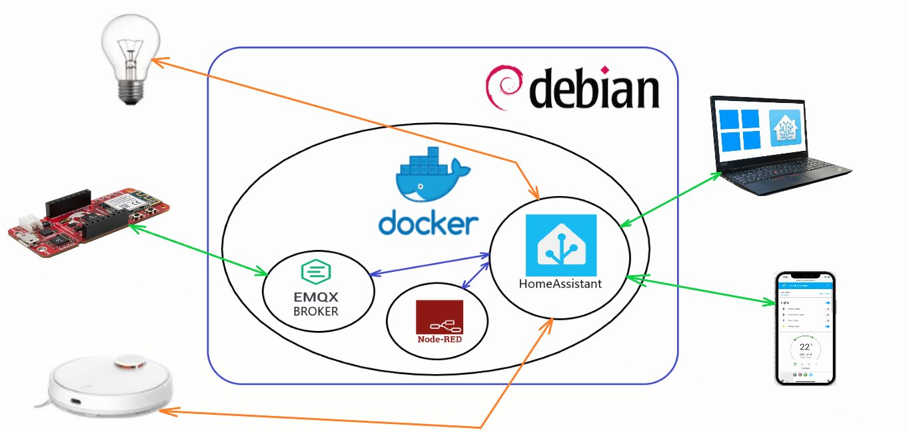

# SmartHome Controller Project - AGH MTM 2023/2024 sem5
- Natalia Kapuścińska
- Paweł Zięba

## Cel
Celem projektu jest przygotowanie oprogramowania dla platformy Microchip AC164164, które pozwoli na akwizycję danych dotyczących temperatury i natężenia światła. Zebrane dane oraz stan dwóch przycisków zostaną przesłane bezprzewodowo do lokalnego serwera Smart-Home opartego na otwartym oprogramowaniu HomeAssistant, za pomocą protokołu MQTT.

## Założenia projektu
- Pomiar temperatury i natężenia światła
- Komunikacja z serwerem SmartHome za pomocą protokołu MQTT
- Łączność bezprzewodowa oparta o standard WiFi
- Możliwość sterowania urządzeniami SmartHome współpracującymi z serwerem HomeAssistant - obługa dwóch przycisków
- Wykrywanie pojedynczego i podwójnego wciśnięcia przycisku, oraz chwilowego przytrzymania.

## Serwer HomeAssistant
Serwer uruchomiono na terminalu Fujitsu z zainstalowanym systemem operacyjnym - Linux Debian 12.\
Skonfigurowano statyczne IP w lokalnej sieci, oraz zdalny dostęp przez SSH.\
Oprogramowanie HomeAssistant zainstalowano w Dockerze, wraz z dodatkami - Supervisor, Broker MQTT, NodeRed.\

## Sposób działania systemu
Zadaniem mikrokontrolera jest rejestrowanie temperatury, natężenia światła i stanów przycisków, oraz wysłanie zebranych danych do serwera HomeAssistant.\
Za pomocą dodatku NodeRed, serwer odpowiednio interpretuje dane otrzymane w formacie json i wykonuje właściwe akcje.\ 
Temperatura i wartość natężenia światła wyświetlane są na dashboard'ie HomeAssistanta, a w zależności od akcji przycisków - włączane lub wyłączane są żarówki WiFi\ współpracujące z integracją TuyaLocal. Dodatkowo możliwe jest włączanie i wyłączanie akcji odkurzania dla robota sprzątającego.

### Uproszczony schemat systemu

